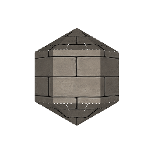
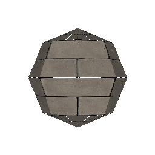
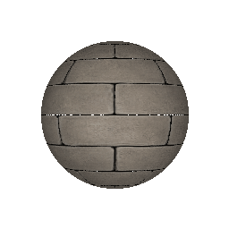

```
 _     _       _   
| |__ | | ___ | |_
| '_ \| |/ _ \| __|
| |_) | | (_) | |_
|_.__/|_|\___/ \__|

 USAGE 
blot <object> [--args]
object :: cube or uv_sphere
--texture :: path to input texture
--out :: path to output gif file
--resolution :: gif resolution (1 - 65535)
--interpolation :: nearest, bilinear or bicubic
--lat :: latitude steps (3 - 65535) for uv_sphere
--lng :: longitude steps (3 - 65535) for uv_sphere
```
**3D Quad-Based Software Renderer made with <3 in Rust**



